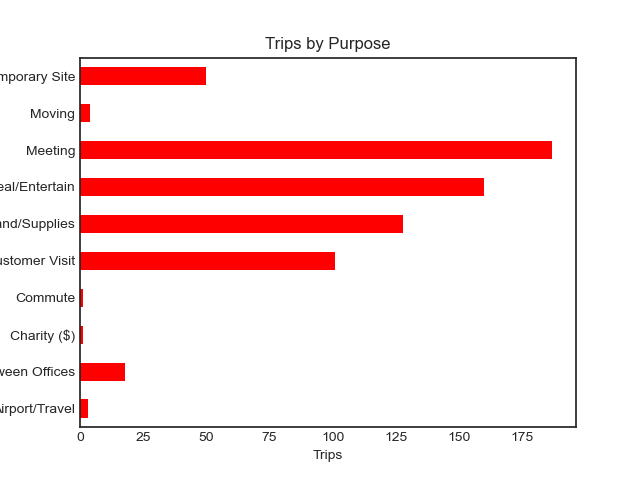

# 🚖 Uber Trips Data Analysis

## 📌 Project Goal
Analyze Uber ride data to uncover travel patterns, identify peak ride times, and understand trip purposes across different days and months.

---

## 🧰 Tools Used
- Python
- Pandas, Matplotlib, Seaborn , datetime
- Jupyter Notebook

---

## 📂 Dataset
- Simulated Uber trip data
- Features include Date, Time, Category, Start Location, End location, Miles and Trip Purpose

---

## 🔍 Key Questions Explored
- What hour do most people take Uber?
- What are the most common trip purposes?
- Which days and months have the highest number of trips?
- Where do most trips start?

---

## 📈 Summary of Insights
- **Peak Hour**: Most trips occur around **5 PM**, indicating high end-of-day demand.
- **Top Month**: **December** had the highest number of rides, likely due to holiday travel and events.
- **Top Day**: **Friday** was the busiest day of the week (206 trips), followed by Tuesday and Monday — weekdays dominate usage.
- **Top Date**: The **19th** saw a spike with 67 rides — possibly tied to a specific event or occasion.
- **Trip Purpose**: The most common purpose was **Meetings** (187 rides), followed by **Meal/Entertain**, **Errands**, and **Customer Visits**.
- **Start Location**: Most trips started from **Cary**, suggesting it’s a key rider hub.

---
  ## 📌 Business Recommendations

- **Driver Supply**: Increase driver availability on **Fridays** and during **December** to meet demand.
- **Promotions**: Target users traveling for **meetings** or **business** with weekday discounts or loyalty rewards.
- **Event-Based Planning**: Investigate high-demand days (e.g., the 19th) to identify recurring events or holidays and plan resource allocation accordingly.
- **Geo-Targeting**: Use **Cary** and similar high-traffic locations for localized marketing or surge strategies.

---

## 📊 Sample Visualizations

### Trips by Hour

### Top Trip Purposes

---
  
## 🧠 Skills Demonstrated
- Data wranglling and time-based analysis using datetime features
- Grouping and aggregating data in Pandas
- Creating meaningful visualizations
- Drawing actionable insights from trip trends
- Business storytelling with data

---

## ✅ Conclusion
This project improved my ability to analyze time-series data, draw business insights, and communicate findings effectively for real-world use cases.
